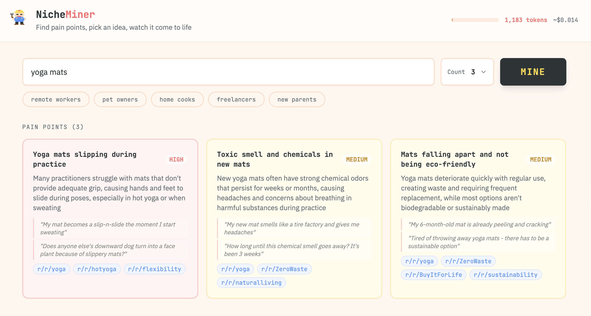
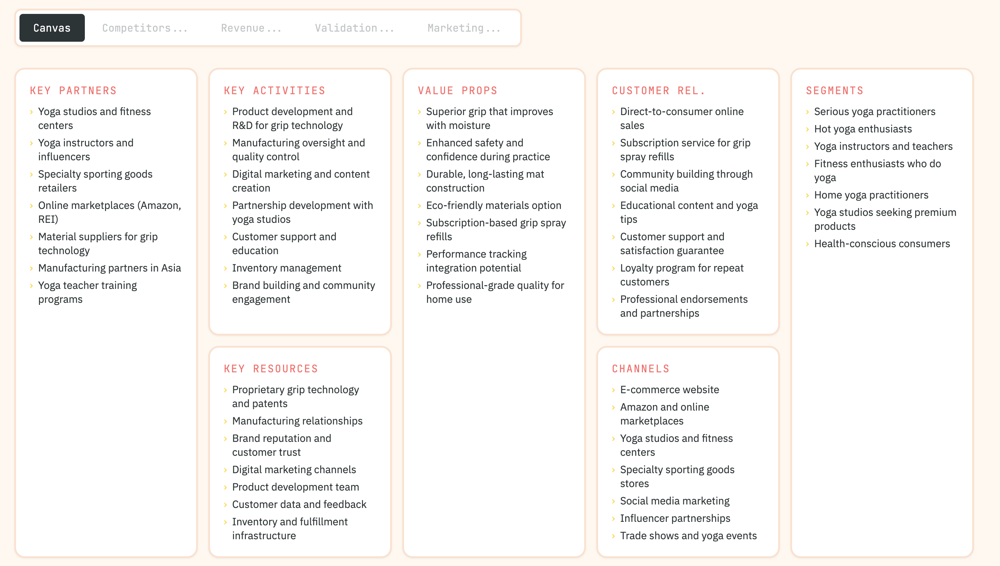
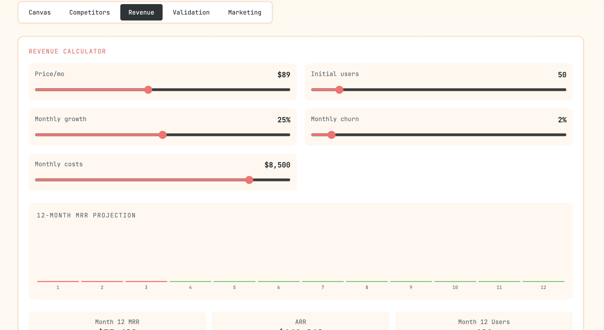
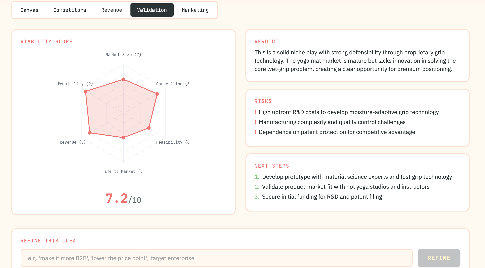
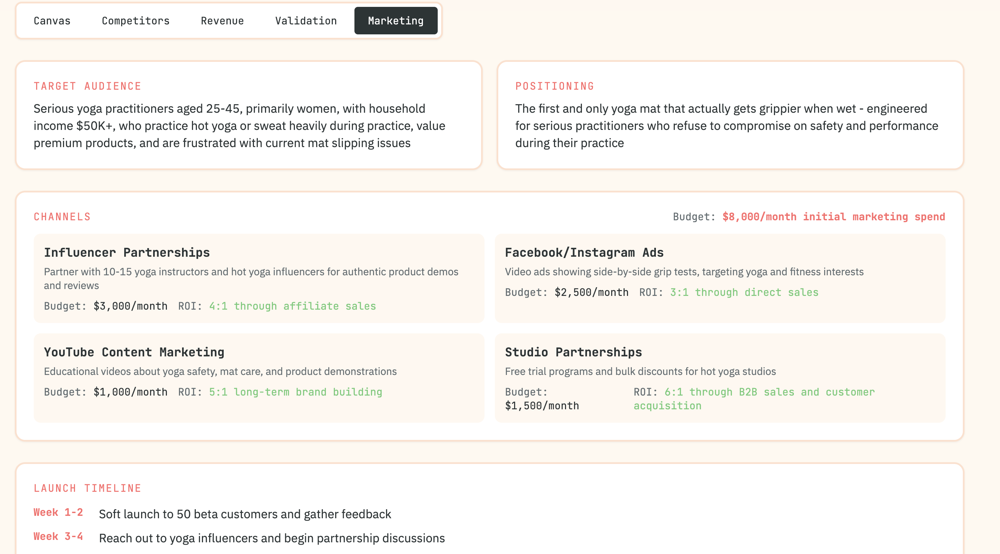

# NicheMiner

AI-powered tool that discovers real pain points from Reddit communities and builds out complete business plans — from competitive analysis to revenue projections.



## How It Works

**Phase 1: Discovery** — Enter a niche (e.g. "remote workers") and NicheMiner instantly identifies pain points people are complaining about on Reddit, complete with representative quotes and severity ratings. Each pain point comes with a business idea.

**Phase 2: Build-Out** — Click any business idea and an AI agent autonomously generates five deliverables:

| Deliverable | What You Get |
|---|---|
| **Business Model Canvas** | Key partners, activities, resources, value props, segments, costs, revenue |
| **Competitive Analysis** | Feature comparison matrix against 3-4 real competitors, market gaps, unfair advantage |
| **Revenue Calculator** | Interactive sliders for price, users, growth, churn — 12-month MRR projection with bar chart |
| **Validation Score** | Radar chart scoring market size, competition, feasibility, time-to-market, revenue, defensibility |
| **Marketing Plan** | Target audience, positioning, channel strategies with budgets, week-by-week launch timeline |

**Phase 3: Refine** — Don't like something? Type feedback like "make it more B2B" or "lower the price point" and the agent re-generates only the affected outputs.










## Tech Stack

- **Backend**: Python, FastAPI, Anthropic SDK (Claude Sonnet)
- **Frontend**: React, TypeScript, Tailwind CSS, Vite
- **Agent**: Raw Anthropic tool-use loop — Claude decides which tools to call
- **Streaming**: Server-Sent Events for real-time progress

## What Makes It Agentic

This isn't prompt chaining. Claude has 5 tools and autonomously decides:
- Which tools to call (and in what order)
- What data to generate for each tool
- During refinement, which tools need re-running based on the user's feedback

A safety valve caps tool calls at 8 per build, and token usage is tracked live in the UI.

## Quick Start

```bash
# 1. Clone
git clone https://github.com/farazfookeer/nicheminer.git
cd nicheminer

# 2. Backend
cd backend
python3 -m venv venv
source venv/bin/activate
pip install -r requirements.txt

# 3. Add your API key
echo "ANTHROPIC_API_KEY=sk-ant-..." > ../.env

# 4. Start backend
uvicorn main:app --reload --port 8000

# 5. Frontend (new terminal)
cd frontend
npm install
npm run dev
```

Open **http://localhost:5173** and start mining.

## Project Structure

```
nicheminer/
├── backend/
│   ├── main.py              # FastAPI app, SSE endpoints
│   ├── agent.py             # Agentic tool-use loop (discover, build, refine)
│   ├── tool_definitions.py  # 5 tool schemas for Anthropic API
│   ├── tools.py             # Reddit scraping (unused in current fast mode)
│   ├── models.py            # Pydantic request models
│   └── requirements.txt
├── frontend/
│   └── src/
│       ├── App.tsx           # Full UI — discovery, build-out tabs, radar chart, revenue calc
│       ├── types.ts          # TypeScript interfaces
│       └── services/api.ts   # SSE client for all endpoints
├── .env                      # ANTHROPIC_API_KEY (not committed)
└── CLAUDE.md
```

## API Endpoints

| Method | Path | Description |
|--------|------|-------------|
| `GET` | `/api/health` | Health check |
| `POST` | `/api/discover` | Fast pain point + idea discovery (SSE) |
| `POST` | `/api/build` | Agentic build-out of a selected idea (SSE) |
| `POST` | `/api/refine` | Re-generate outputs based on feedback (SSE) |
| `POST` | `/api/cancel/{id}` | Cancel an in-progress build |

## Built With

Built by [Faraz Fookeer](https://github.com/farazfookeer) with Claude Opus 4.6 via [Claude Code](https://claude.com/claude-code).
